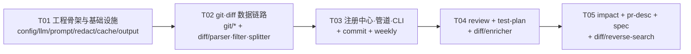

# git-agent-toolkit 任务分解

> 配套文档：`docs/architecture.md`（文件清单与接口签名以此为准）
> 共 **5 个任务**，按 T01 → T05 顺序执行，对应 P0 → P1 → P2/P3。
> 每个任务自包含一组**相关文件**，一次写完再进下一个；不要跨任务并行写同一批文件。

---

## 任务总览

| ID | 标题 | 阶段 | 依赖 | 文件数 | 预估 |
|---|---|---|---|---|---|
| **T01** | 工程骨架与基础设施 | P0 | — | ~35 | 0.5 天 |
| **T02** | git / diff 数据链路 | P0 | T01 | ~10 | 1 天 |
| **T03** | 注册中心 + 管道 + CLI + `commit` / `weekly` | P0 | T02 | ~28 | 1.5 天 |
| **T04** | `review` + `test-plan`（含上下文补全） | P1 | T03 | ~18 | 2 天 |
| **T05** | `impact` + `pr-desc` + `spec`（含反向符号搜索） | P2/P3 | T04 | ~14 | 2 天 |

> T03 之后每个任务**只新增文件 + 一行 `register()`**，不改动 core 任何已有文件 —— 这是 Feature 注册制的核心收益，验收时要检查这一点。

---

## T01 — 工程骨架与基础设施

**阶段** P0 ｜ **依赖** 无 ｜ **优先级** P0

### 目标
把 npm workspaces monorepo 搭起来，写完全部与"业务功能"无关的基础设施：类型、错误、日志、路径、配置、脱敏、缓存、prompt 加载、LLM 适配、报告落盘。

### 涉及文件

**仓库根（6）**
- `package.json` — workspaces 根，`scripts`: `build` / `dev` / `test` / `link` / `clean`
- `tsconfig.base.json` — `ES2022` + `NodeNext` + `strict` + `declaration` + `sourceMap`
- `.gitignore` — `node_modules` `dist` `.env` `.git-agent/cache` `.git-agent/reports`
- `.env.example` — `DEEPSEEK_API_KEY=sk-xxxx`
- `README.md` — 安装（`npm i && npm run build && npm link`）、7 个命令示例、加新功能的 3 步
- `scripts/copy-assets.mjs` — 拷贝 `packages/core/prompts/` → `packages/core/dist/prompts/`（纯 Node，跨平台）

**`packages/core` 包配置（2）**
- `packages/core/package.json` — `@git-agent/core`，`"type":"module"`, `exports: ./dist/index.js`, `files:["dist"]`，`build: tsc -p . && node ../../scripts/copy-assets.mjs`
- `packages/core/tsconfig.json`

**`packages/core/src` 基础设施（14）**
- `src/types.ts` — `ExitCode` `LogLevel` `RepoInfo` `ProgressEvent` `Logger` `UsageTotals`
- `src/errors.ts` — `GitAgentError(code, message, hint?)` + `ErrorCode` 枚举 + `isGitAgentError()`
- `src/logger.ts` — `createLogger(level)`：分级、写 stderr、非 TTY 降级
- `src/paths.ts` — `toPosix` `samePath` `safeBranchName` `relativeTo`
- `src/util/async.ts` — `sleep` `mapWithConcurrency`（自写，不引 p-limit）
- `src/util/text.ts` — `normalizeEol` `truncateLines`
- `src/config/types.ts` — `GitAgentConfig` / `ResolvedConfig`（`architecture.md` §3.8）
- `src/config/defaults.ts` — `DEFAULT_CONFIG`（方案 §7 全量 + 新增 `diff` / `cache` 节）
- `src/config/schema.ts` — zod **partial** schema + `validateConfig(raw)` 友好报错
- `src/config/loader.ts` — 四层合并（defaults → `~/.git-agent/config.yml` → `<repo>/.git-agent/config.yml` → CLI 覆盖）+ `dotenv` 载入 `DEEPSEEK_API_KEY`
- `src/config/index.ts`
- `src/redact/rules.ts` — 脱敏正则表 + 默认路径黑名单
- `src/redact/redactor.ts` — `createRedactor(cfg, logger): Redactor`（`redact(text)` / `isBlocked(path)`）
- `src/redact/index.ts`

**`src/cache`（2）**
- `src/cache/disk-cache.ts` — `createDiskCache(root, {enabled, maxAgeDays})`：`read/write/clear/stats`，落 `.git-agent/cache/<ns>/<sha1>.json`，损坏视为未命中
- `src/cache/index.ts`

**`src/prompt`（3）**
- `src/prompt/loader.ts` — `loadPrompt(name, vars?)` / `loadShared(...)` / `promptRoot()`（`dist/prompts` 优先，dev 回退 `src/../prompts`）
- `src/prompt/layout.ts` — `composePrompt({instructions, rules, schema, fewShot, variable})` → `{system, user}`，**variable 永远在 user 末尾**
- `src/prompt/index.ts`

**`src/llm`（5）**
- `src/llm/types.ts` — `LLMProvider` `LLMRequest` `LLMResponse` `ModelTier` `ThinkingMode`
- `src/llm/deepseek.ts` — openai SDK，`baseURL: https://api.deepseek.com`；`thinking:{type:'enabled'}` + `reasoning_effort`；`response_format: json_object`；**禁止出现 `deepseek-chat`/`deepseek-reasoner`**
- `src/llm/budget.ts` — `estimateTokens` `withinBudget` `truncateToBudget`（按 hunk 边界截）
- `src/llm/retry.ts` — `withRetry(fn, {retries, baseDelayMs})`，429/5xx/超时才重试，**不做熔断**
- `src/llm/index.ts` — `createLLMProvider(cfg, logger)`

**`src/output`（2）**
- `src/output/writer.ts` — `resolveOutputPath()` / `writeReport()` / `printSummary()`（UTF-8 + LF，递归建目录）
- `src/output/index.ts`

**`src/render`（3）**
- `src/render/markdown.ts` — `mdTable` `mdHeading` `severityIcon`
- `src/render/json.ts` — `toJsonEnvelope(featureId, output, data, usage)`
- `src/render/index.ts`

**`src/index.ts`** — 统一出口

### 实现要点
1. `tsconfig.base.json` 的 `module: NodeNext` 要求**所有相对 import 带 `.js` 后缀**（`import { x } from './foo.js'`），写文件时注意。
2. `config/loader.ts` 读不到 `DEEPSEEK_API_KEY` 时**不立即报错**，到 LLM 首次调用时才抛 `NO_API_KEY`（`config init` 命令不需要 Key）。
3. `estimateTokens` 只用于分级与分片，**宁可高估**（`architecture.md` §5.1）。
4. `disk-cache` 的 `read` 必须捕获 JSON.parse 异常并返回 `null`。
5. `composePrompt` 的 `system` 在分片场景下必须是**同一字符串实例/字节一致** —— 由调用方（`steps.ts`）计算一次复用，此处只做拼接。

### 验收标准
- [ ] `npm install` 在根目录一次装完两个 workspace（npm workspaces，无 pnpm-lock）。
- [ ] `npm run build` 成功；`packages/core/dist/prompts/` 下能看到全部 `.md`。
- [ ] `node -e "import('@git-agent/core')"` 不报错（或 `tsx` 下 `import('../src/index.ts')` 成功）。
- [ ] 单测覆盖：`config/loader`（四层合并顺序 + CLI 覆盖优先级）、`redact/rules`（每条正则有正反例）、`llm/budget`、`paths`（Windows 路径）。
- [ ] 在**无 `DEEPSEEK_API_KEY`** 的情况下，`createLLMProvider()` 能建成、调用时才抛 `NO_API_KEY` 且 `hint` 有内容。
- [ ] 全项目 `console.log` 只出现在 `output/writer.ts` 与 CLI 包内。

---

## T02 — git / diff 数据链路

**阶段** P0 ｜ **依赖** T01 ｜ **优先级** P0

### 目标
把"从 git 拿数据 → 结构化 → 过滤 → 分级分片"这条链路打通，产出可缓存的 `CollectedData`。**本任务不接 LLM，纯本地逻辑，可单测覆盖。**

### 涉及文件

**`src/git`（3）**
- `src/git/types.ts` — `GitProvider` 接口（`architecture.md` §3.2）+ `LogOptions` `CommitInfo` `GrepHit`
- `src/git/cli-provider.ts` — `simple-git` 实现；**三点语法铁律**；`searchText` 用 `listRepoFiles()` + Node 读文件正则（不 spawn `git grep`，Windows 更稳）
- `src/git/index.ts`

**`src/diff`（4）**
- `src/diff/parser.ts` — `parseDiff(text): FileChange[]`；按 `\r?\n` 切行；处理 `A/M/D/R/C/T`、二进制标记、多 hunk、`@@ ... @@ func()` 上下文
- `src/diff/filter.ts` — `filterFiles(files, rules): FilterResult`；`picomatch` 匹配 `ignorePaths` / `blockedPaths`；生成文件识别（`*.lock` `dist/` `*.min.js` `__snapshots__/`）
- `src/diff/splitter.ts` — `estimateTokens` `gradeScale` `splitIntoChunks` `buildOutline`（算法见 `architecture.md` §5.1）
- `src/diff/index.ts`

**`src/features/shared`（4，采集器 + prompt 片段，先建骨架）**
- `src/features/shared/collect-branch.ts` — `collectBranchDiff(ctx, {base, head})`：merge-base → 指纹 → 缓存读写 → diff → parse → filter → grade → split → 返回 `CollectedData`
- `src/features/shared/collect-staged.ts` — `collectStaged(ctx, opts)`：暂存区 diff + `getRecentSubjects(n)`；空则抛 `NO_DATA`
- `src/features/shared/collect-log.ts` — `collectWeekLog(ctx, {since, until, authors})`：`--all --numstat`
- `src/features/shared/prompt-blocks.ts` — `blockDiff` `blockCommits` `blockStats` `blockModuleContext` `blockTeamRules`

**`src/types.ts`（补充 diff 相关类型）** — `FileChange` `Hunk` `DiffLine` `DiffStats` `DiffChunk` `DiffScale` `CollectedData` `CollectKind`

### 实现要点
1. **`git diff <base>...<head>` 三点语法**（铁律）；`git log <base>..<head>` 才是两点 —— 两者不要混。
2. 指纹：`sha1(mergeBase + ':' + headSha + ':' + hash(ignorePaths + blockedPaths))`，写进 `CollectedData.fingerprint`。
3. `splitIntoChunks` 必须处理"单文件超过单片预算"的情况：按 hunk 边界切，不切断行。
4. `searchText` 加硬上限（4000 文件 / 200 命中），超了置 `truncated`。
5. `collect-*.ts` 的缓存读失败 → 当未命中；缓存写失败 → warn 后继续。

### 验收标准
- [ ] 在真实仓库执行 `tsx` 脚本调用 `collectBranchDiff`，能拿到 `files` / `stats` / `commits`，且 `diffText` 与 `git diff base...head` 内容一致（过滤后）。
- [ ] 三点语法验证：在 base 合入新 commit 后重跑，`files` 不应出现"本分支没删却被标记删除"的文件。
- [ ] `gradeScale` 三组阈值（<8K / 8K–60K / >60K）各有一个构造用例。
- [ ] 同一分支连续跑两次，第二次日志出现"命中采集缓存"且结果一致。
- [ ] 单测：`parser`（CRLF、重命名、二进制、多 hunk、空 diff）、`filter`（glob 命中/未命中）、`splitter`（超预算单文件切分 + 同目录聚合）。

---

## T03 — Feature 注册中心 + 执行管道 + CLI + `commit` / `weekly`

**阶段** P0 ｜ **依赖** T02 ｜ **优先级** P0

### 目标
把"命令解析 → 上下文组装 → 采集 → LLM → 渲染 → 落盘 → 退出码"全链路跑通，并交付两个 P0 功能。**本任务结束即可日常使用。**

### 涉及文件

**`src/features` 核心（3）**
- `src/features/registry.ts` — `Feature` / `FeatureContext` / `PromptStep`（`SingleStep | MapStep`）/ `ParamDef` / `register` / `getFeature` / `listFeatures`（签名见 `architecture.md` §3.5）
- `src/features/pipeline.ts` — `runPipeline(feature, data, ctx)`：按序执行 step，`runIf` 跳过，map 步 `mapWithConcurrency`，每步前脱敏 + `composePrompt` + `withRetry` + zod `safeParse`（失败带错误重试 1 次）→ `reduce` → 汇总 `usage`
- `src/features/index.ts` — `registerAll()`（本任务注册 `commit` `weekly`）

**P0 功能：`commit`（2 + 2 prompt）**
- `src/features/commit/schema.ts` — `CommitCandidateSchema` / `CommitOutputSchema`（3 个候选：`type` `scope` `subject` `body`，外加 `splitHint`）
- `src/features/commit/index.ts` — `collect = collectStaged`；**单步** `fast` + `off`；`render` 输出候选清单；CLI 侧交互选 1-3 / e 编辑 / n 取消；确认后 `git.commit(msg)`
- `prompts/commit/system.md`、`prompts/commit/draft.md`

**P0 功能：`weekly`（3 + 2 prompt）**
- `src/features/weekly/schema.ts` — 工作项（`title` `weightPercent` `bullets[]` `status`）+ 概览 / 问题 / 下周计划 / 需要支持
- `src/features/weekly/history.ts` — `findLastWeeklyReport(root)`：扫 `.git-agent/reports/*/weekly-*.md` 取最近一期
- `src/features/weekly/index.ts` — `collect = collectWeekLog`；读 `--note` / `--note-file` / 编辑器；单步 `strong` + `high`；人工补充内容**不改写**
- `prompts/weekly/system.md`、`prompts/weekly/draft.md`

**共享 prompt 资产（3）**
- `prompts/shared/anti-hallucination.md` — 方案 §4.3 四条硬约束（**全局注入**）
- `prompts/shared/output-format.md` — Markdown + JSON 双视图、`[推断]` 标注、`待补充` 占位
- `prompts/shared/severity-scale.md` — review 用，本任务先建好

**`packages/cli`（11）**
- `packages/cli/package.json` — `git-agent-toolkit`，`bin: { "git-agent": "bin/git-agent.js" }`
- `packages/cli/tsconfig.json`
- `bin/git-agent.js` — shebang + `import('../dist/index.js').then(m => m.main())`
- `src/index.ts` — `main()`：建 ctx → `registerAll()` → `registerCommands()` → `program.parseAsync()` → 顶层 try/catch → `exitWith(code)`。**唯一允许 `process.exit` 的文件**
- `src/context.ts` — `buildContext(argv)`：config → git → llm → logger → redactor → cache → `onProgress`
- `src/register-commands.ts` — 遍历 registry 生成 commander 子命令；自动挂全局参数 `--base --head --out --stdout --model --json --dry-run --no-cache -v`
- `src/interactive.ts` — `selectOne` `confirm` `editInEditor`（`node:readline`，不用第三方 prompts）
- `src/terminal.ts` — `checkTerminal()`（Windows `chcp` 非 65001 时 warn 提示）+ `isTty()`
- `src/exit.ts` — `EXIT = {OK:0, ERR:1, BLOCKER:2, NO_DATA:3}` + `exitWith`
- `src/commands/config.ts` — `config init`：生成 `.git-agent/config.yml`（含注释）、`.git-agent/context/example.md`、`~/.git-agent/rules.md`
- `src/commands/hooks.ts` — `hooks install|uninstall`：写/删 `.git/hooks/prepare-commit-msg`（shim 调 `git-agent commit --prefill --out "$1"`，支持 `GIT_AGENT_DISABLE` 与 `--no-verify`）
- `src/commands/cache.ts` — `cache clear|stats`

### 实现要点
1. `pipeline.ts` 是**唯一编排者**，Feature 只声明 steps，不自己调 LLM。
2. zod 校验失败重试时，把 `error.issues` 摘要追加到 user prompt 末尾（"上次输出不符合 schema：<issues>，请修正后重新输出 JSON"）。
3. `commit --prefill` 模式：**任何错误都吞掉**，debug 日志一行，退出 0。
4. `commit` 提交成功后才算"写操作"；用户选 `n` 取消 → 退出 3（无数据）而不是 1。
5. `weekly` 的时间窗默认本周一 00:00 ~ now，可用 `--since/--until` 覆盖。
6. `--dry-run` 在 pipeline 层统一拦：打印 `{system, user}` 后返回，不发请求。

### 验收标准
- [ ] `npm link` 后 `git-agent --help` 列出命令；`git-agent commit --help` 自动带出该 Feature 的 `params`。
- [ ] **在真实仓库跑通 `git-agent commit`**：暂存区有改动 → 输出 3 个候选 → 选 1 → 成功提交；暂存区为空 → 退出码 3。
- [ ] `git-agent weekly --note "…"` 产出一份真实周报，人工内容原样保留，量化数字（提交数/文件数）与 `git log` 统计一致。
- [ ] `git-agent commit --dry-run` 打印完整 prompt 且不调用 API（无 Key 也能跑）。
- [ ] `git-agent hooks install` 后执行 `git commit`（不带 `-m`）能预填 message；`GIT_AGENT_DISABLE=1 git commit` 不触发。
- [ ] 报告默认落在 `.git-agent/reports/YYYY-MM/<branch>-<cmd>-<时间>.md`，终端只有一行摘要。
- [ ] 新增一个 Feature 只需改 `features/index.ts` 加一行 `register(...)`，CLI 不需要任何改动（用一个临时 `hello` Feature 验证后删除）。

---

## T04 — `review` + `test-plan`（含上下文补全）

**阶段** P1 ｜ **依赖** T03 ｜ **优先级** P1

### 目标
交付 map-reduce 三遍式的代码审查，以及复用同一份采集缓存的测试计划。**本任务开始体现"第二个命令不额外花钱"。**

### 涉及文件

**上下文补全（1 + 1 prompt）**
- `src/diff/enricher.ts` — `createEnricher(git, cfg)`；懒加载 `ts-morph`（`await import('ts-morph')`，失败降级 regex）；`enrich(files, {maxTokens})`；触发阈值 `diff.enrichThresholdLines`（默认 30），总量上限 `diff.enrichMaxTokens`（默认 20000）
- prompt 无（补全片段直接拼进 `{diff}` 块，由 `prompt-blocks.ts` 插入）

**`src/features/shared`（1）**
- `src/features/shared/steps.ts` — `chunkMapStep()` / `summaryStep()` 工厂：统一组装 system 前缀（保证字节一致）+ 分级 map/汇总逻辑

**`review`（2 + 4 prompt）**
- `src/features/review/schema.ts` — `ReviewIssueSchema`（`file` `line` `category` `severity: blocker|major|minor|nit` `title` `detail` `suggestion` `confidence`）+ `ReviewOutputSchema`（`overview` `intent` `issues[]` `crossFile[]` `risks` `highlights` `questions`）
- `src/features/review/index.ts` — `collect = collectBranchDiff`（**命中 T02 的同一份缓存**）；steps：`[outline?]` → `chunk`(map, `fast`, `off`) → `summary`(single, `strong`, `high`) → `cross-file`(single, `strong`, `high`, `runIf: files.length > 3`)；`reduce` 合并；`exitCode: 有 blocker → 2`
- `prompts/review/system.md`（稳定前缀 + 严重度标准引用）
- `prompts/review/chunk.md`（Pass A 分片分析）
- `prompts/review/summary.md`（Pass B 去重/排序/定级/结论）
- `prompts/review/cross-file.md`（Pass C 跨文件一致性、接口变更同步）

**`test-plan`（2 + 3 prompt）**
- `src/features/test-plan/schema.ts` — `TestCaseSchema`（`changePoint` `scenario` `priority: P0|P1|P2` `type: unit|integration|manual` `alreadyCovered`）
- `src/features/test-plan/index.ts` — steps：`extract`(map over chunks, `fast`, `off`) → `plan`(single, `fast`, `off`)；`extra` 里带已有测试文件清单（供 `detectExisting` 去重）
- `prompts/test-plan/system.md`、`extract.md`、`plan.md`

**共享 prompt（1，补内容）**
- `prompts/shared/severity-scale.md` — 写死阻断/重要/建议/吹毛求疵的判定标准（方案 §4.1 注）

### 实现要点
1. `outline` step 只在 `scale === 'large'` 时出现，用 `runIf` 控制：先发"文件清单 + 每个文件一行 numstat 摘要"，让模型挑重点文件，后续 map 只跑重点文件（其余合并为 1 片摘要级）。
2. **Pass A 的 `system` 字符串在所有分片间必须完全一致**（`buildSteps` 里算一次，不要在每个 item 里重新拼），否则前缀缓存不命中。
3. `enricher` 抛错只记 warn + 写进 `CollectedData.degraded`，**绝不中断**。
4. `review` 报告的统计数字（文件数 / +842 -317 / commit 数）全部来自 `data.stats`，**不让模型算**。
5. `cross-file` 的输入是"文件级摘要 + 接口签名变更"，不是完整 diff（省 token）。

### 验收标准
- [ ] 拿一个真实 MR 跑 `git-agent review`：报告含概览 / 变更意图（标 `[推断]` 并有依据）/ 分级问题清单 / 跨文件问题 / 亮点 / 待确认。
- [ ] 先跑 `review` 再跑 `test-plan`，第二次日志显示**命中采集缓存**，且 LLM 调用是新的一轮（采集零成本）。
- [ ] 大 diff（>60K token）走 `outline` 路径，日志能看到"挑出 N 个重点文件"。
- [ ] 有 blocker 时退出码为 2，无 blocker 为 0。
- [ ] 上下文补全生效：报告中能引用到 diff 之外（±3 行之外）的函数全貌；未装 `ts-morph` 时报告「说明」段写明降级为正则。
- [ ] `--json` 输出的 `stats` 与 `git diff --numstat` 手工统计一致。

---

## T05 — `impact` + `pr-desc` + `spec`（含反向符号搜索）

**阶段** P2 / P3 ｜ **依赖** T04 ｜ **优先级** P2 / P3

### 目标
交付剩下三个功能 + `ask` 自然语言入口。**本任务完成即 7 个功能全部齐活。**

### 涉及文件

**反向符号搜索（1）**
- `src/diff/reverse-search.ts` — `extractChangedSymbols(files)` + `reverseSearch(git, symbols, {maxDepth, includeTests, mode})`；`grep` 模式用 `git.listRepoFiles()` + Node 正则读文件；`ts-morph` 模式可选；**最多上溯 2 层**；硬上限 4000 文件 / 200 命中；返回 `{symbols, direct, indirect, mode, truncated}`

**`impact`（2 + 2 prompt）**
- `src/features/impact/schema.ts` — `ImpactPointSchema`（`location` `symbol` `needsChange: yes|no|unknown` `reason`）+ 回归路径 + 待确认列表
- `src/features/impact/index.ts` — `collect = collectBranchDiff`；**符号提取与引用搜索在本地完成（不调 LLM）**；单个判定 step（`strong` + `high`）；判不了的输出 `[待确认]`
- `prompts/impact/system.md`、`draft.md`

**`pr-desc`（3 + 3 prompt）**
- `src/features/pr-desc/template.ts` — `resolvePrTemplate(git, cfg)`：按序探测 `.git/pull_request_template.md` → `.github/PULL_REQUEST_TEMPLATE.md` → `.gitlab/merge_request_templates/Default.md` → 内置默认
- `src/features/pr-desc/schema.ts` — 章节数组 `{heading, body}`（按模板动态填充，模板里没有的章节不硬加）
- `src/features/pr-desc/index.ts` — `collect = collectBranchDiff`；读缓存里已有的 `review` / `test-plan` 结果（`result` 命名空间）供 `--with-review` 复用；单步 `strong` + `high`
- `prompts/pr-desc/system.md`、`draft.md`、`default-template.md`

**`spec`（2 + 2 prompt）**
- `src/features/spec/schema.ts` — 八章结构（背景目标 / 需求拆解 / 整体设计 / 关键实现 / 决策权衡表 / 影响范围 / 风险 TODO / 验收要点）
- `src/features/spec/index.ts` — `collect = collectBranchDiff`；steps：`outline`(strong) → `draft`(map over 重点文件, strong) → `final`(single, strong)；**决策痕迹提取**（TODO/FIXME、feature flag、兼容分支、try/catch 兜底、性能优化、数据结构选型、被删的旧实现）+ 每决策输出"不这么选的后果"
- `prompts/spec/system.md`、`draft.md`

**`ask` 入口（1）**
- `src/commands/ask.ts` — 把 `listFeatures()` 的 id + description 拼给模型，让它挑一个 + 给参数；**打印将执行的命令与参数，用户确认后才 dispatch**；不猜测、不自动执行

**注册（1）**
- `src/features/index.ts` — 追加 `register(impactFeature)` `register(prDescFeature)` `register(specFeature)`

### 实现要点
1. `reverseSearch` 的 `maxDepth` 默认 2，**代码里硬夹 `Math.min(maxDepth, 2)`**，防指数爆炸。
2. `impact` 的"是否真受影响"交给模型判定，本地只提供 `signature` + 命中行原文；模型输出 `unknown` 时渲染成 `[待确认]`。
3. `pr-desc` 复用 review 结果时，**读不到就跳过**（不是错误），不要为了复用而先跑一遍 review。
4. `spec` 的 `outline` step 复用 T04 同一套 `steps.ts` 工厂。
5. `ask` 必须展示"将要执行的命令 + 参数"并等确认 —— 方案 §8.5 明确要求。

### 验收标准
- [ ] `git-agent impact` 能列出被改导出符号、直接影响、间接影响（≤2 层）、建议回归路径、待确认项。
- [ ] 改一个公共组件（多处引用）时，影响清单与 `grep` 手工核对一致，无误报爆炸。
- [ ] 未装 `ts-morph` 时 `impact` 自动走 `grep` 模式并在报告标注降级来源。
- [ ] `git-agent pr-desc` 按仓库实际 PR 模板填充；无模板时用内置默认；`--with-review` 能复用已有 review 结论。
- [ ] `git-agent spec` 输出的「关键决策与权衡」表中每条都有"不这么选的后果"。
- [ ] `git-agent ask "帮我生成本周周报"` 打印将执行的 `weekly` 命令与参数，确认后正确执行。
- [ ] **回归检查**：7 个命令全部可从 `--help` 看到；连续跑 `review` → `test-plan` → `impact` → `pr-desc`，只有第一次采集，后三次均命中缓存。

---

## 全局收尾检查（T05 完成后）

- [ ] 全项目**无** `deepseek-chat` / `deepseek-reasoner` 字符串。
- [ ] `@git-agent/core` 的 `src/` 下**无** `vscode`、`document`、`window`、`React` 等 UI/DOM 相关 import（用 grep 扫一遍）。
- [ ] 除 `src/git/cli-provider.ts` 外，无任何文件 spawn 外部进程（除 `hooks install` 需要）。
- [ ] 除 `commit` 命令外，无任何文件调用 `gitProvider.commit()` 或其他写操作。
- [ ] 所有单文件 ≤ 250 行；`npm test` 全绿。
- [ ] README 中"加一个新功能"的 3 步（新建 `features/xxx/index.ts` + `prompts/xxx/*.md` + 一行 `register`）经过实测。
